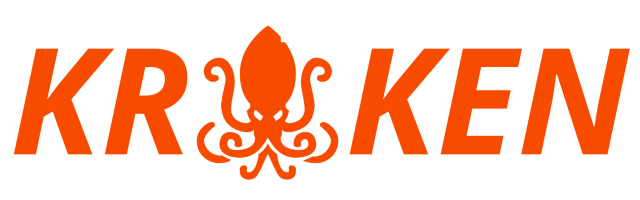

# :octopus: The kraken-project :octopus:

The aim of this project is to create a fast, scalable pentesting platform.

It integrates existing tools as well as provides own implementations 
for some attacks / reconnaissance work.  

️:warning: **Caution**:

Please note that this project is under heavy development. 
Expect breaking changes every once in a while.

## Contact

You want to discuss something? Get in touch with us in our [matrix
room](https://matrix.to/#/#kraken:matrix.hopfenspace.org).
